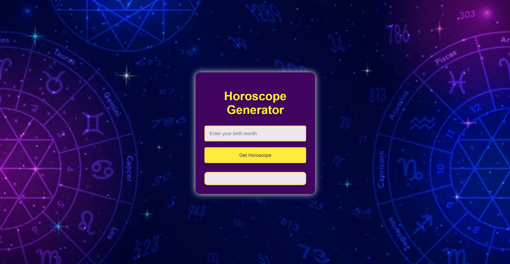

# Horoscope Generator

This is a simple Horoscope Generator web application. Users can enter their birth month to receive a random horoscope based on their zodiac sign.

## Table of Contents

- [Overview](#overview)
  - [Features](#features)
  - [Screenshot](#screenshot)
  - [Links](#links)
- [Getting Started](#getting-started)
  - [Installation](#installation)
  - [Usage](#usage)
- [Built With](#built-with)
- [Author](#author)

## Overview

### Features

- Enter your birth month to get your zodiac sign and a random horoscope.
- Responsive design for both desktop and mobile devices.

### Screenshot



### Links

- [Live Site](https://horoscope-generator-dev.vercel.app/)
- [Repository](https://github.com/Pushkar111/horoscope-generator)

## Getting Started

### Installation

1. Clone the repository:
   ```sh
    git clone https://github.com/Pushkar111/horoscope-generator.git

2. Navigate to the project directory:
    cd horoscope-generator

### Usage

1. Open `index.html` in your web browser to use the application.

## Built With

- HTML
- CSS
- JavaScript

## Author

- GitHub - [@Pushkar111](https://github.com/Pushkar111)
- LinkedIn - [pushkarmodi111](https://www.linkedin.com/in/pushkarmodi111/)